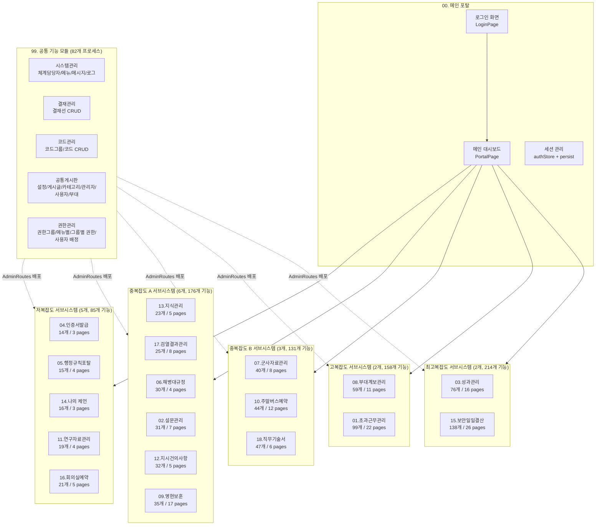
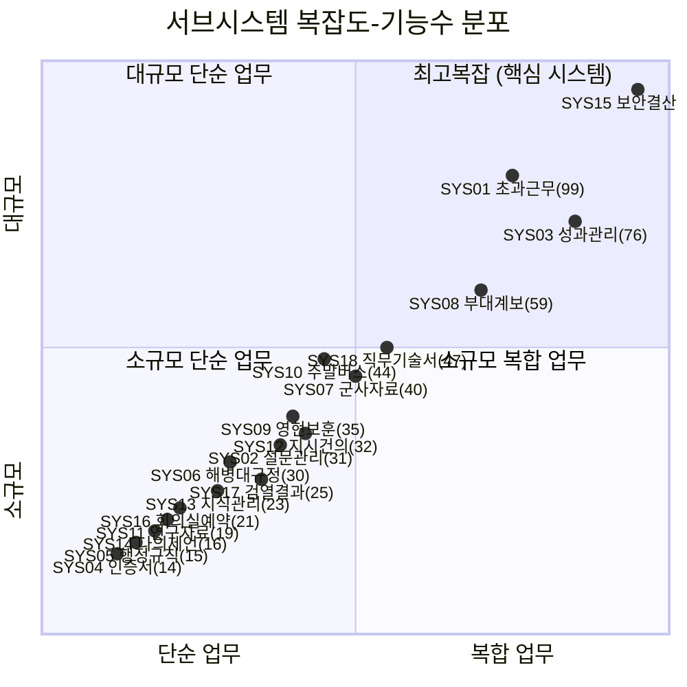
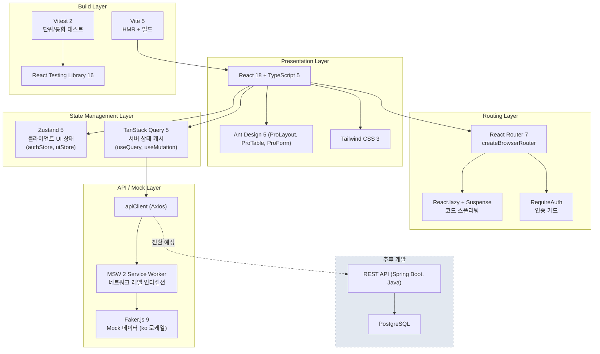
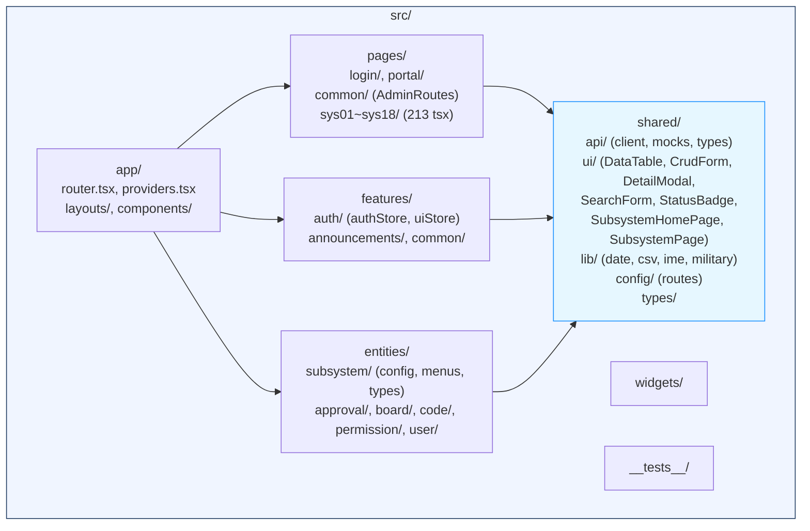
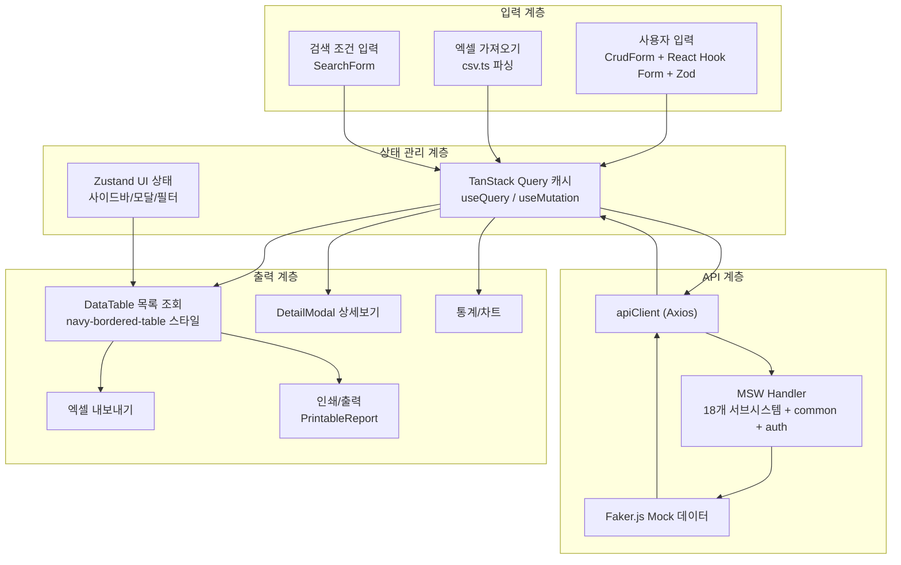
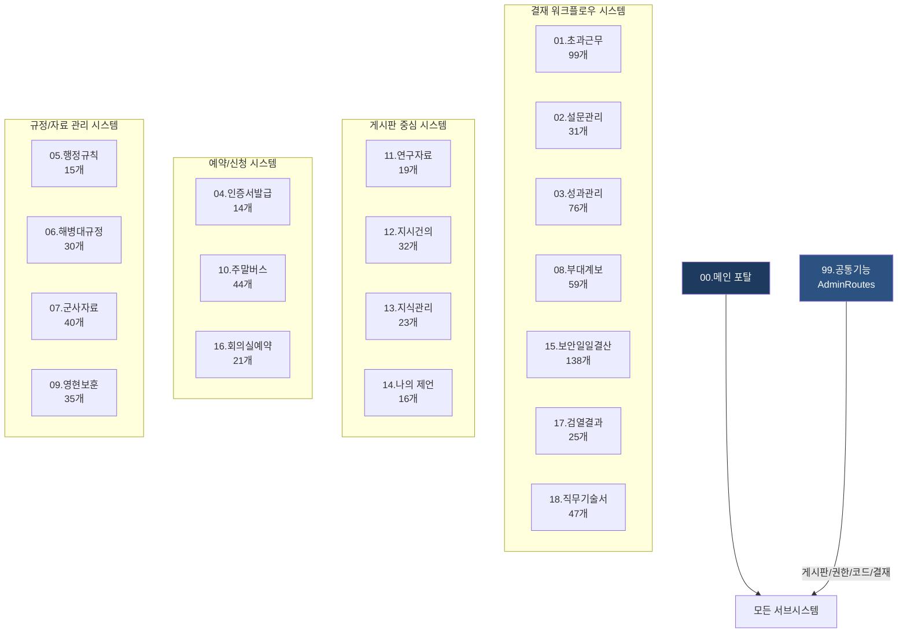
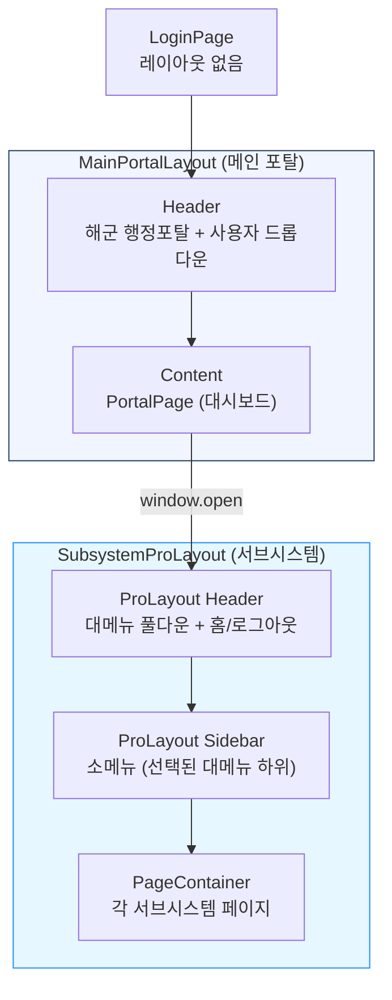

# 해병대 행정포탈 시스템 조감도

## 1. 시스템 전체 조감도

메인 포탈(00)을 중심으로 18개 서브시스템이 공통 모듈(99)을 공유하며 독립 운영되는 구조.



## 2. 시스템 규모 요약

| 구분 | 서브시스템 수 | 프로세스 수 | 페이지 수 | 비율 |
|------|:---:|:---:|:---:|:---:|
| 공통 기능 | 1 | 82 | 26 | 9.7% |
| 저복잡도 | 5 | 85 | 19 | 10.1% |
| 중복잡도 A | 6 | 176 | 46 | 20.8% |
| 중복잡도 B | 3 | 131 | 26 | 15.5% |
| 고복잡도 | 2 | 158 | 33 | 18.7% |
| 최고복잡도 | 2 | 214 | 42 | 25.3% |
| **합계** | **19** | **845** | **213** (tsx) | **100%** |

## 3. 서브시스템 분류 맵



## 4. 기술 아키텍처 레이어 다이어그램



## 5. 사용자 접속 흐름

```mermaid
flowchart LR
    A[사용자] --> B{로그인<br/>/login}
    B -->|인증 성공| C[메인 포탈<br/>대시보드 /]
    B -->|인증 실패| B
    C --> D[서브시스템 클릭<br/>window.open]
    D --> E[SubsystemProLayout<br/>ProLayout 사이드바+헤더]
    E --> F[업무 기능<br/>수행]
    F --> G{완료?}
    G -->|다른 메뉴| E
    G -->|포탈 복귀| H[window.close<br/>→ opener.focus]
    G -->|세션 만료| I[/login 리다이렉트]

    style A fill:#1E3A5F,color:#fff
    style C fill:#2C5282,color:#fff
    style E fill:#3182CE,color:#fff
```

## 6. 폴더 구조 조감도



## 7. 데이터 흐름 조감도



## 8. 서브시스템 업무 유형별 분류



## 9. 레이아웃 구조 조감도


