# 해병대 행정포탈 시스템 다이어그램

## 1. C4 Context 다이어그램 (Level 1)

시스템 외부 경계에서 바라본 사용자와 외부 시스템 관계.

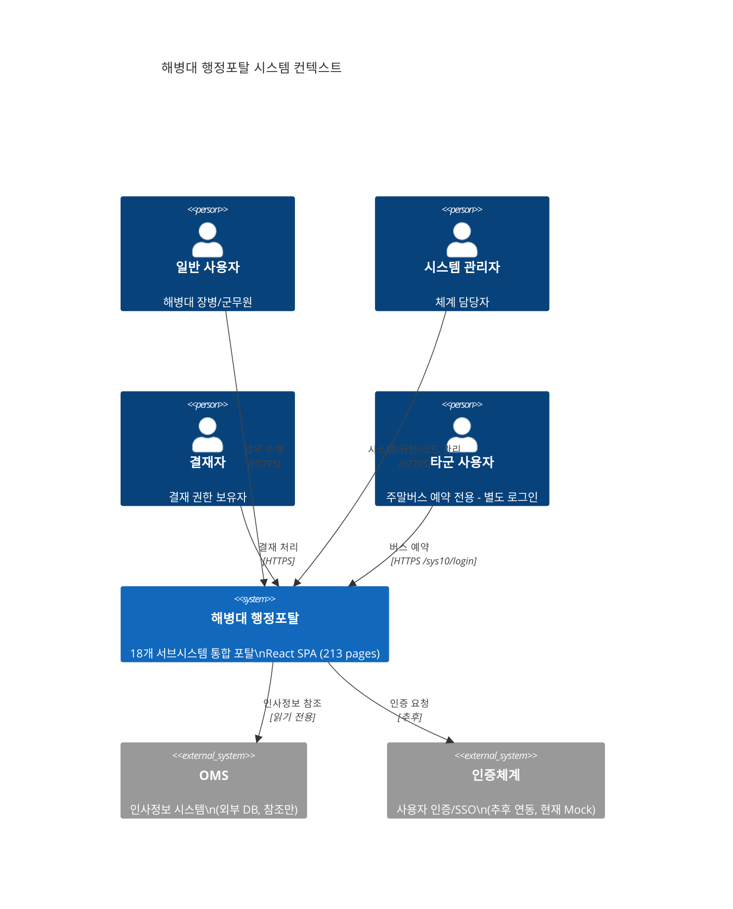

## 2. C4 Container 다이어그램 (Level 2)

시스템 내부 컨테이너 구성. 현재 MVP 단계에서는 SPA + MSW만 운영 중.

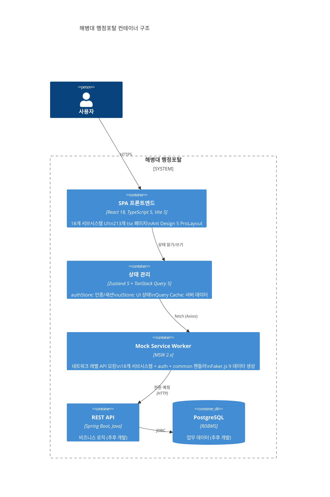

## 3. 모듈 의존성 다이어그램

FSD(Feature-Sliced Design) 기반 레이어 구조. 상위 레이어는 하위만 참조.

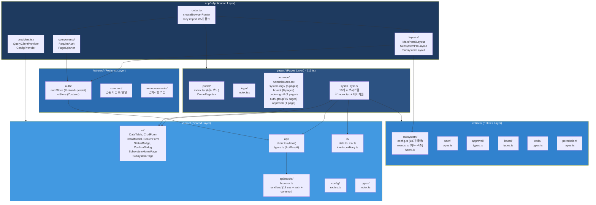

## 4. 결재 워크플로우 다이어그램

결재 기능을 사용하는 시스템: SYS01, SYS02, SYS03, SYS08, SYS15, SYS17, SYS18.

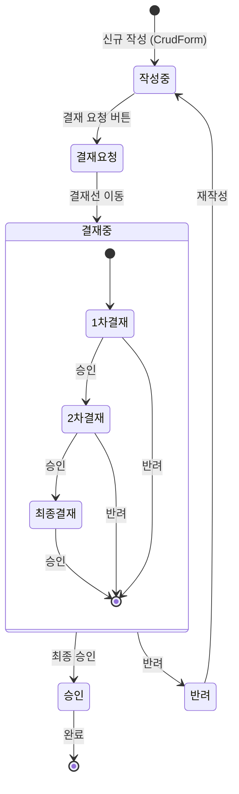

## 5. 인증/세션 흐름 다이어그램

Zustand persist 기반 세션 관리. 30분 만료, 크로스탭 로그아웃 지원.

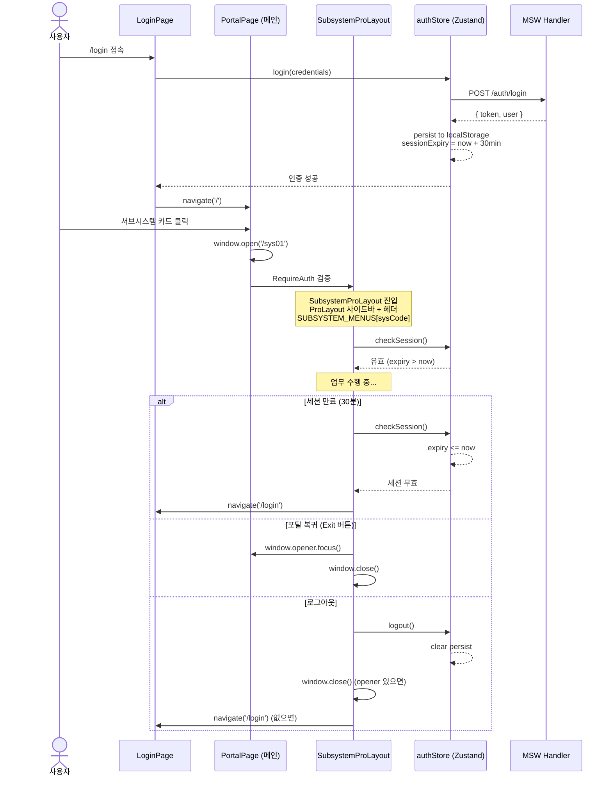

## 6. 라우팅 구조 다이어그램

createBrowserRouter 기반 2단 레이아웃 라우팅.

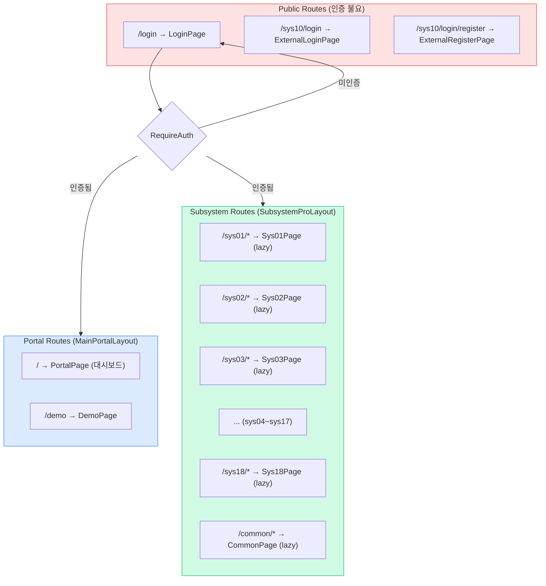

## 7. 공통 게시판 처리 흐름

AdminRoutes를 통해 18개 서브시스템 각각에 동일 소스로 배포.

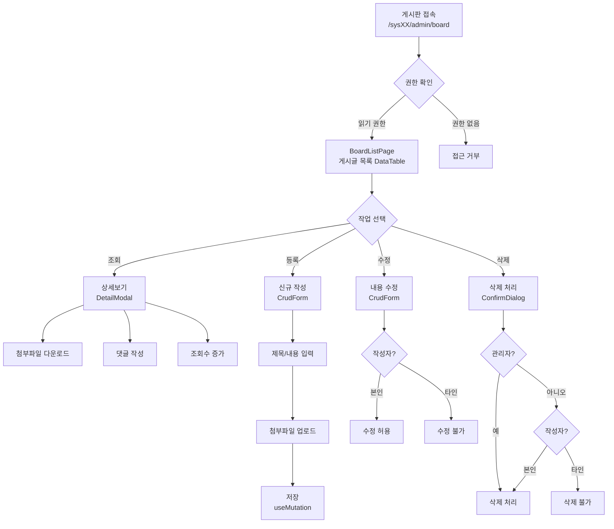

## 8. 데이터 CRUD 패턴 다이어그램

모든 서브시스템이 공유하는 표준 CRUD 패턴.

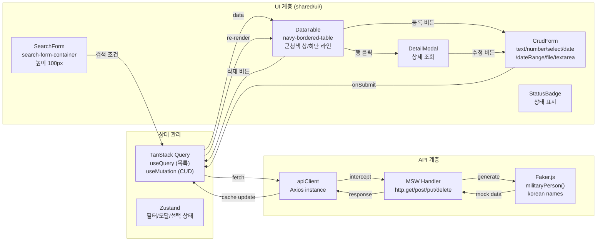

## 9. 서브시스템 간 관계 다이어그램

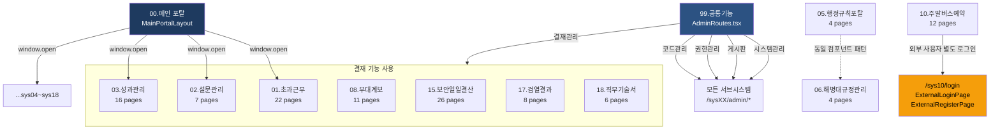

## 10. Code Splitting 다이어그램

React.lazy + Suspense 기반 라우트 레벨 코드 스플리팅.

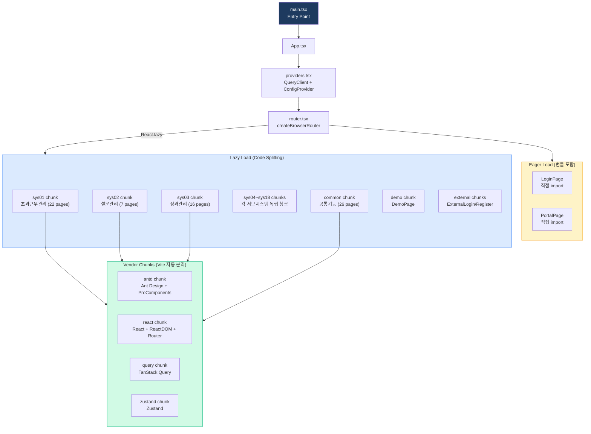

## 11. 배포 구성 다이어그램

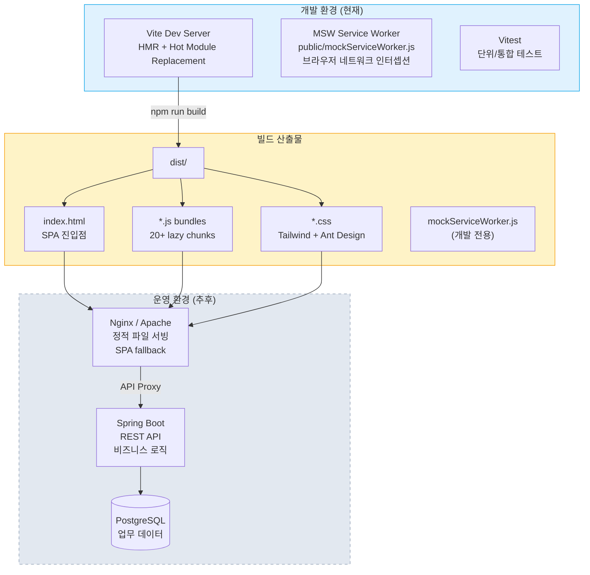

## 12. 공유 컴포넌트 의존성 맵

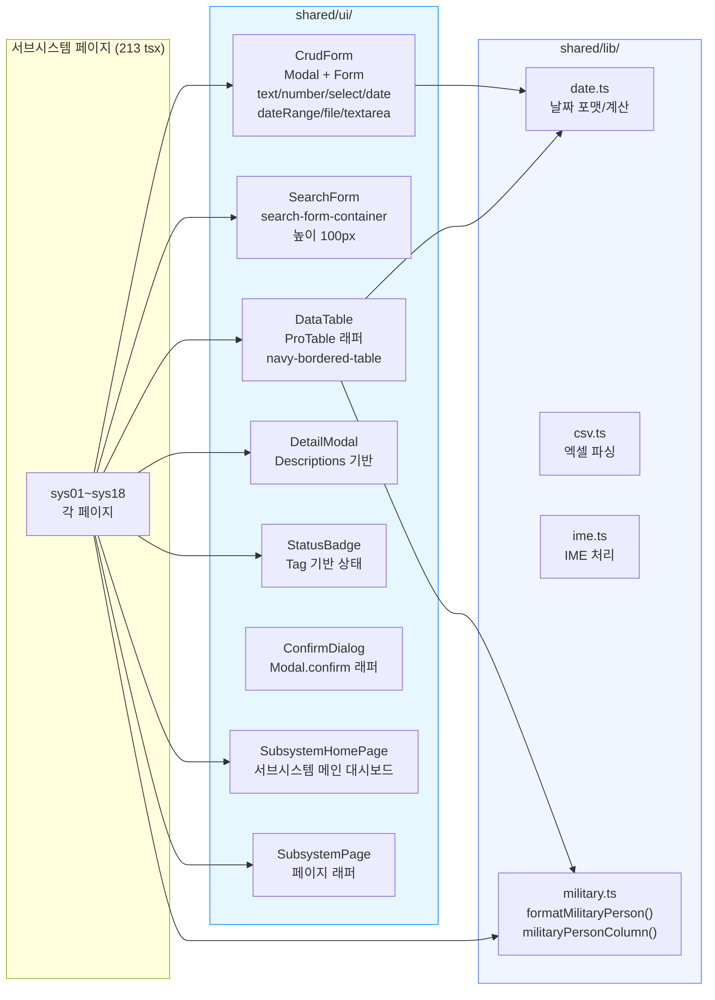
