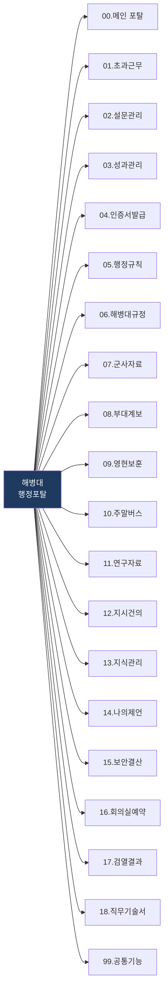
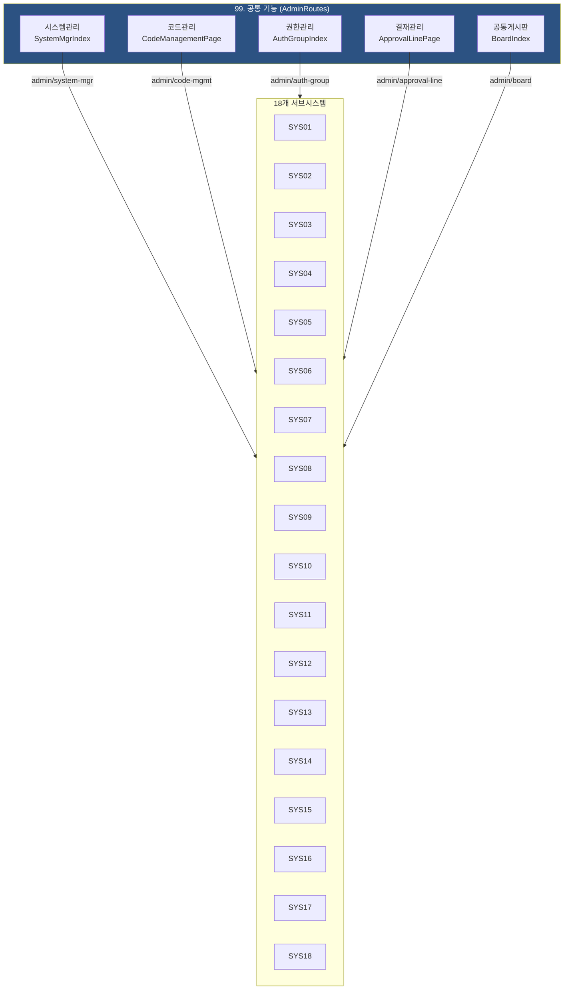

# 해병대 행정포탈 메뉴 구조도

> 18개 서브시스템 + 공통기능의 전체 메뉴 트리를 라우트 기준으로 문서화한다.
> 각 항목은 실제 구현된 index.tsx 라우트와 CSV 스펙을 기반으로 작성되었다.

---

## 전체 시스템 구조



---

## 00. 메인 포탈

| 경로 | 화면명 | 컴포넌트 | 설명 |
|------|--------|----------|------|
| `/login` | 로그인 | LoginPage | ID/PW 인증 (Mock) |
| `/` | 메인 대시보드 | PortalPage | 18개 서브시스템 카드형 링크 |
| `/demo` | 데모 페이지 | DemoPage | 공통 컴포넌트 데모 |
| `/sys10/login` | 외부 사용자 로그인 | ExternalLoginPage | 타군 사용자 전용 로그인 |
| `/sys10/login/register` | 외부 사용자 회원가입 | ExternalRegisterPage | 타군 사용자 회원가입 |

**레이아웃 구조:**
- 메인 포탈: `MainPortalLayout` (헤더만, 사이드바 없음)
- 서브시스템: `SubsystemProLayout` (ProLayout 사이드바 포함)
- 모든 경로는 `RequireAuth` 래퍼로 인증 필수 (외부 로그인 제외)

---

## 01. 초과근무관리체계 (99개 프로세스)

```
/sys01
+-- 메인화면 (/) --> SubsystemHomePage
|
+-- 1. 신청서 관리
|   +-- 1-1. 신청서 작성 (/sys01/1/1) --> OtRequestPage
|   +-- 1-2. 신청서 결재 (/sys01/1/2) --> OtApprovalPage
|   +-- 1-3. 일괄처리 (/sys01/1/3) --> OtBulkPage
|   +-- 1-4. 일괄처리 승인 (/sys01/1/4) --> OtBulkApprovalPage
|   +-- 1-5. 월말결산 (/sys01/1/5) --> OtMonthlyClosingPage
|
+-- 2. 현황조회
|   +-- 2-1. 나의 근무현황 (/sys01/2/1) --> OtMyStatusPage
|   +-- 2-2. 나의 부재관리 (/sys01/2/2) --> OtAbsencePage
|   +-- 2-3. 부대 근무 현황 (/sys01/2/3) --> OtUnitStatusPage
|   +-- 2-4. 부대 근무 통계 (/sys01/2/4) --> OtUnitStatusPage
|   +-- 2-5. 부대 부재 현황 (/sys01/2/5) --> OtUnitStatusPage
|   +-- 2-6. 월말결산 현황 (/sys01/2/6) --> OtMonthlyStatusPage
|   +-- 2-7. 자료 출력 (/sys01/2/7) --> OtUnitPersonnelPage
|
+-- 3. 부대관리
|   +-- 3-1. 부대인원 조회 (/sys01/3/1) --> OtUnitPersonnelPage
|   +-- 3-2. 최대인정시간 (/sys01/3/2) --> OtMaxHoursPage
|   +-- 3-3. 근무시간 관리 (/sys01/3/3) --> OtWorkHoursPage
|   +-- 3-4. 공휴일 관리 (/sys01/3/4) --> OtHolidayPage
|   +-- 3-5. 결재선 관리 (/sys01/3/5) --> OtApprovalLinePage
|
+-- 4. 당직업무
|   +-- 4-1. 초과근무자 관리 (/sys01/4/1) --> OtDutyWorkerPage
|   +-- 4-2. 당직개소 관리 (/sys01/4/2) --> OtDutyPostPage
|   +-- 4-3. 당직개소 변경 (/sys01/4/3) --> OtDutyPostChangePage
|   +-- 4-4. 개인별 당직개소 승인 (/sys01/4/4) --> OtPersonalDutyApprovalPage
|   +-- 4-5. 개인별 부서 이동 승인 (/sys01/4/5) --> OtPersonalDeptApprovalPage
|
+-- 5. 개인설정
|   +-- 5-1. 개인설정 정보 (/sys01/5/1) --> OtPersonalSettingPage
|   +-- 5-2. 개인별 당직개소 설정 (/sys01/5/2) --> OtPersonalDutyPage
|   +-- 5-3. 개인별 부서 설정 (/sys01/5/3) --> OtPersonalDeptPage
|
+-- 6. 게시판
|   +-- 6-1. 공지사항 (/sys01/6/1) --> BoardListPage (boardId=sys01-notice)
|   +-- 6-2. 질의응답 (/sys01/6/2) --> BoardListPage (boardId=sys01-qna)
|
+-- 7. 관리자 (/sys01/admin/*)
    +-- 시스템관리 (/sys01/admin/system-mgr) --> SystemMgrIndex
    +-- 코드관리 (/sys01/admin/code-mgmt) --> CodeManagementPage
    +-- 권한관리 (/sys01/admin/auth-group) --> AuthGroupIndex
    +-- 결재관리 (/sys01/admin/approval-line) --> ApprovalLinePage
    +-- 공통게시판 (/sys01/admin/board) --> BoardIndex
```

---

## 02. 설문종합관리체계 (31개 프로세스)

```
/sys02
+-- 메인화면 (/) --> SubsystemHomePage
|
+-- 1. 설문관리
|   +-- 1-1. 게시판 (/sys02/1/1) --> BoardIndex (공통)
|   +-- 1-2. 나의 설문관리 (/sys02/1/2) --> MySurveyPage
|   |   +-- 문항 편집 (/sys02/1/2/edit/:id) --> SurveyQuestionEditor
|   +-- 1-3. 설문참여 (/sys02/1/3) --> SurveyParticipationPage
|   |   +-- 설문 응답 폼 (/sys02/1/3/:id) --> SurveyFormPage
|   +-- 1-4. 지난 설문보기 (/sys02/1/4) --> PastSurveyPage
|   +-- 1-5. 체계관리 (/sys02/1/5) --> SurveyAdminPage
|
+-- 2. 관리자
|   +-- 2-1. 코드관리 (/sys02/2/1) --> CodeMgmtIndex (공통)
|   +-- 2-2. 권한관리 (/sys02/2/2) --> AuthGroupIndex (공통)
|
+-- 관리자 대메뉴 (/sys02/admin/*) --> AdminRoutes (공통)
```

---

## 03. 성과관리체계 (76개 프로세스)

```
/sys03
+-- 메인화면 (/) --> SubsystemHomePage (대시보드=PerfMainPage)
|
+-- 1. 대시보드
|   +-- 1-1. 성과 대시보드 (/sys03/1/1) --> PerfMainPage
|
+-- 2. 기준정보관리
|   +-- 2-1. 기준연도 관리 (/sys03/2/1) --> PerfBaseYearPage
|   +-- 2-2. 평가조직 관리 (/sys03/2/2) --> PerfEvalOrgPage
|   +-- 2-3. 업무실적(개인) 관리 (/sys03/2/3) --> PerfIndividualTargetPage
|   +-- 2-4. 정책방향 관리 (/sys03/2/4) --> PerfPolicyPage
|   +-- 2-5. 지시과제 관리 (/sys03/2/5) --> PerfMainTaskPage
|   +-- 2-6. 주요과제 관리 (/sys03/2/6) --> PerfSubTaskPage
|   +-- 2-7. 세부과제 관리 (/sys03/2/7) --> PerfDetailTaskPage
|
+-- 3. 연간과제관리
|   +-- 3-1. 추진진도율 (/sys03/3/1) --> PerfProgressRatePage
|   +-- 3-2. 과제등록 (/sys03/3/2) --> PerfSubTaskPage
|   +-- 3-3. 업무실적 입력 (/sys03/3/3) --> PerfTaskResultInputPage
|   +-- 3-4. 과제실적 승인 (/sys03/3/4) --> PerfTaskResultApprovalPage
|   +-- 3-5. 과제실적 평가 (/sys03/3/5) --> PerfTaskResultEvalPage
|   +-- 3-6. 업무실적(개인) 평가 (/sys03/3/6) --> PerfIndividualResultEvalPage
|
+-- 4. 평가결과
|   +-- 4-1. 평가결과 (/sys03/4/1) --> PerfEvalResultPage
|   +-- 4-2. 입력현황 (/sys03/4/2) --> PerfInputStatusPage
|
+-- 5. 게시판
|   +-- 5-1. 공지사항 (/sys03/5/1) --> BoardListPage (boardId=sys03-notice)
|   +-- 5-2. 질의응답 (/sys03/5/2) --> BoardListPage (boardId=sys03-qna)
|   +-- 5-3. 자료실 (/sys03/5/3) --> BoardListPage (boardId=sys03-data)
|
+-- 6. 과제검색
|   +-- 6-1. 과제검색 (/sys03/6/1) --> PerfTaskSearchPage
|
+-- 관리자 대메뉴 (/sys03/admin/*) --> AdminRoutes (공통)
```

---

## 04. 인증서발급신청체계 (14개 프로세스)

```
/sys04
+-- 메인화면 (/) --> SubsystemHomePage
|
+-- 1. 인증서발급신청
|   +-- 1-1. 게시판 (/sys04/1/1) --> BoardIndex (공통)
|   +-- 1-2. 인증서 신청 (/sys04/1/2) --> CertificateApplyPage
|   +-- 1-3. 인증서 승인/관리 (/sys04/1/3) --> CertificateApprovalPage
|   +-- 1-4. 인증서 등록대장 (/sys04/1/4) --> CertificateRegisterPage
|
+-- 2. 관리자
|   +-- 2-1. 코드관리 (/sys04/2/1) --> CodeMgmtIndex (공통)
|   +-- 2-2. 권한관리 (/sys04/2/2) --> AuthGroupIndex (공통)
|
+-- 관리자 대메뉴 (/sys04/admin/*) --> AdminRoutes (공통)
```

---

## 05. 행정규칙포탈체계 (15개 프로세스)

```
/sys05
+-- 메인화면 (/) --> SubsystemHomePage
|
+-- 1. 해군규정
|   +-- 1-1. 현행규정 (/sys05/1/1) --> RegulationListPage
|
+-- 2. 예규
|   +-- 2-1. 해군본부 (/sys05/2/1) --> PrecedentHQPage
|   +-- 2-2. 예하부대 (/sys05/2/2) --> PrecedentUnitPage
|
+-- 3. 지시
|   +-- 3-1. 지시문서 (/sys05/3/1) --> DirectiveListPage
|
+-- 관리자 대메뉴 (/sys05/admin/*) --> AdminRoutes (공통)
```

---

## 06. 해병대규정관리체계 (30개 프로세스)

```
/sys06
+-- 메인화면 (/) --> SubsystemHomePage
|
+-- 1. 해병대규정
|   +-- 1-1. 현행규정 (/sys06/1/1) --> RegulationListPage
|
+-- 2. 예규
|   +-- 2-1. 해병대사령부 (/sys06/2/1) --> PrecedentHQPage
|   +-- 2-2. 예하부대 (/sys06/2/2) --> PrecedentUnitPage
|
+-- 3. 지시
|   +-- 3-1. 지시문서 (/sys06/3/1) --> DirectiveListPage
|
+-- 4. 게시판
|   +-- 4-1. 공지사항 (/sys06/4/1) --> BoardIndex (boardType=notice)
|   +-- 4-2. 규정예고 (/sys06/4/2) --> BoardIndex (boardType=regulation-notice)
|   +-- 4-3. 자료실 (/sys06/4/3) --> BoardIndex (boardType=archive)
|
+-- 5. 관리자
|   +-- 5-1. 권한관리 (/sys06/5/1) --> AuthGroupIndex (공통)
|
+-- 관리자 대메뉴 (/sys06/admin/*) --> AdminRoutes (공통)
```

---

## 07. 군사자료관리체계 (40개 프로세스)

```
/sys07
+-- 메인화면 (/) --> SubsystemHomePage
|
+-- 1. 군사자료 관리
|   +-- 1-1. 군사자료 관리 (/sys07/1/1) --> MilDataListPage
|   +-- 1-2. 군사자료 활용 (/sys07/1/2) --> MilDataUsagePage
|   +-- 1-3. 통계자료 (/sys07/1/3) --> MilDataStatsPage
|
+-- 2. 해기단자료
|   +-- 2-1. 해기단자료 (/sys07/2/1) --> HaegidanListPage
|
+-- 3. 관리자
|   +-- 3-1. 코드관리 (/sys07/3/1) --> CodeMgmtIndex (공통)
|   +-- 3-2. 권한관리 (/sys07/3/2) --> AuthGroupIndex (공통)
|
+-- 관리자 대메뉴 (/sys07/admin/*) --> AdminRoutes (공통)
```

---

## 08. 부대계보관리체계 (59개 프로세스)

```
/sys08
+-- 메인화면 (/) --> SubsystemHomePage
|
+-- 1. 게시판
|   +-- 1-1. 공지사항 (/sys08/1/1) --> BoardListPage (boardId=sys08-notice)
|
+-- 2. 권한신청
|   +-- 2-1. 권한신청 (/sys08/2/1) --> UnitAuthRequestPage
|   +-- 2-2. 권한관리 (/sys08/2/2) --> UnitAuthMgmtPage
|   +-- 2-3. 권한조회 (/sys08/2/3) --> UnitAuthViewPage
|
+-- 3. 주요활동
|   +-- 3-1. 주요활동 관리 (/sys08/3/1) --> UnitActivityPage
|   +-- 3-2. 주요활동 결재 (/sys08/3/2) --> UnitActivityApprovalPage
|
+-- 4. 주요직위자
|   +-- 4-1. 주요직위자 관리 (/sys08/4/1) --> UnitKeyPersonPage
|
+-- 5. 제원/계승부대
|   +-- 5-1. 계승부대 트리 (/sys08/5/1) --> UnitLineageTreePage
|
+-- 6. 부대기/부대마크
|   +-- 6-1. 부대기/마크 관리 (/sys08/6/1) --> UnitFlagPage
|
+-- 7. 통계 및 출력
|   +-- 7-1. 입력 통계 (/sys08/7/1) --> UnitStatsPage
|
+-- 8. 부대기록부
|   +-- 8-1. 부대기록부 (/sys08/8/1) --> UnitRecordPage
|
+-- 관리자 대메뉴 (/sys08/admin/*) --> AdminRoutes (공통)
```

---

## 09. 영현보훈체계 (35개 프로세스)

```
/sys09
+-- 메인화면 (/) --> SubsystemHomePage
|
+-- 1. 게시판
|   +-- 1-1. 공지사항 (/sys09/1/1) --> BoardIndex (공통)
|
+-- 2. 자료입력
|   +-- 2-1. 사망자 관리 (/sys09/2/1) --> DeceasedPage
|   +-- 2-2. 상이자 관리 (/sys09/2/2) --> InjuredPage
|   +-- 2-3. 전공사상심사 관리 (/sys09/2/3) --> ReviewPage
|
+-- 3. 통계 및 자료 출력
|   +-- 3-1. 국가유공자 확인서(사망자) (/sys09/3/1) --> CertMeritDeathPage
|   +-- 3-2. 국가유공자 확인서(상이자) (/sys09/3/2) --> CertMeritInjuredPage
|   +-- 3-3. 전공사상심사결과 (/sys09/3/3) --> CertReviewResultPage
|   +-- 3-4. 순직/사망확인서 (/sys09/3/4) --> CertDeathPage
|   +-- 3-5. 사망자 현황 보고서 (/sys09/3/5) --> ReportDeceasedPage
|   +-- 3-6. 상이자 현황 보고서 (/sys09/3/6) --> ReportInjuredPage
|   +-- 3-7. 신분별 사망자 현황 (/sys09/3/7) --> StatsTypePage
|   +-- 3-8. 월별 사망자 현황 (/sys09/3/8) --> StatsMonthPage
|   +-- 3-9. 연도별 사망자 현황 (/sys09/3/9) --> StatsYearPage
|   +-- 3-10. 부대별 사망자 현황 (/sys09/3/10) --> StatsUnitPage
|   +-- 3-11. 부대별 사망자 명부 (/sys09/3/11) --> StatsUnitListPage
|   +-- 3-12. 전사망자 명부 (/sys09/3/12) --> StatsAllListPage
|   +-- 3-13. 전사망자 확인증 발급대장 (/sys09/3/13) --> CertIssueLedgerPage
|
+-- 관리자 대메뉴 (/sys09/admin/*) --> AdminRoutes (공통)
```

---

## 10. 주말버스예약관리체계 (44개 프로세스)

```
/sys10
+-- 메인화면 (/) --> SubsystemHomePage
|
+-- 1. 주말버스
|   +-- 1-1. 공지사항 (/sys10/1/1) --> BoardListPage (boardId=sys10-notice)
|   +-- 1-2. 주말버스 예약 (/sys10/1/2) --> BusReservationPage
|   +-- 1-3. 대기자관리 (/sys10/1/3) --> BusWaitlistPage
|   +-- 1-4. 예약현황 (/sys10/1/4) --> BusReservationStatusPage
|   +-- 1-5. 배차관리 (/sys10/1/5) --> BusDispatchPage
|   +-- 1-6. 예약시간관리 (/sys10/1/6) --> BusSchedulePage
|   +-- 1-7. 사용현황 (/sys10/1/7) --> BusUsagePage
|   +-- 1-8. 위규자관리 (/sys10/1/8) --> BusViolatorPage
|   +-- 1-9. 타군 사용자 관리 (/sys10/1/9) --> ExternalUserPage
|
+-- 2. 관리자
|   +-- 2-1. 코드관리 (/sys10/2/1) --> CodeGroupPage (공통)
|   +-- 2-2. 권한관리 (/sys10/2/2) --> PermissionGroupPage (공통)
|
+-- 관리자 대메뉴 (/sys10/admin/*) --> AdminRoutes (공통)
|
+-- [외부 접근 경로]
    +-- 외부 로그인 (/sys10/login) --> ExternalLoginPage
    +-- 외부 회원가입 (/sys10/login/register) --> ExternalRegisterPage
```

---

## 11. 연구자료종합관리체계 (19개 프로세스)

```
/sys11
+-- 메인화면 (/) --> SubsystemHomePage (대시보드=ResearchMainPage)
|
+-- 1. 연구자료종합관리
|   +-- 1-1. 연구자료 대시보드 (/sys11/1/1) --> ResearchMainPage
|   +-- 1-2. 연구자료 목록 (/sys11/1/2) --> ResearchListPage
|   +-- 1-3. 연구파일 관리 (/sys11/1/3) --> ResearchFilePage
|   +-- 1-4. 게시판 (/sys11/1/4) --> BoardIndex (공통)
|   +-- 1-5. 관리자 (/sys11/1/5) --> ResearchAdminPage
|
+-- 2. 관리자
|   +-- 2-1. 권한관리 (/sys11/2/1) --> AuthGroupIndex (공통)
|
+-- 관리자 대메뉴 (/sys11/admin/*) --> AdminRoutes (공통)
```

---

## 12. 지시건의사항관리체계 (32개 프로세스)

```
/sys12
+-- 메인화면 (/) --> SubsystemHomePage
|
+-- 1. 게시판
|   +-- 1-1. 공지사항 (/sys12/1/1) --> BoardIndex (공통)
|   +-- 1-2. 질의응답 (/sys12/1/2) --> BoardIndex (공통)
|
+-- 2. 지시사항
|   +-- 2-1. 대통령 지시사항 (/sys12/2/1) --> BoardIndex (읽기전용)
|   +-- 2-2. 국방부장관 지시사항 (/sys12/2/2) --> BoardIndex (읽기전용)
|   +-- 2-3. 지휘관 지시사항 (/sys12/2/3) --> DirectiveView (추진현황+목록)
|
+-- 3. 건의사항
|   +-- 3-1. 지휘관 건의사항 (/sys12/3/1) --> ProposalView (추진현황+목록)
|
+-- 4. 관리자
|   +-- 4-1. 지시건의 관리 (/sys12/4/1) --> DirectiveAdminPage
|
+-- 관리자 대메뉴 (/sys12/admin/*) --> AdminRoutes (공통)
```

---

## 13. 지식관리체계 (23개 프로세스)

```
/sys13
+-- 메인화면 (/) --> SubsystemHomePage
|
+-- 1. 게시판
|   +-- 1-1. 공지사항 (/sys13/1/1) --> BoardIndex (공통)
|
+-- 2. 지식관리
|   +-- 2-1. 나의 지식 관리 (/sys13/2/1) --> MyKnowledgePage
|   +-- 2-2. 지식 관리(관리자) (/sys13/2/2) --> KnowledgeAdminPage
|
+-- 3. 지식열람
|   +-- 3-1. 지식열람 (/sys13/3/1) --> KnowledgeListPage
|
+-- 4. 지식통계
|   +-- 4-1. 지식통계 (/sys13/4/1) --> KnowledgeStatsPage
|
+-- 5. 관리자
|   +-- 5-1. 코드관리 (/sys13/5/1) --> CodeMgmtIndex (공통)
|   +-- 5-2. 메뉴관리 (/sys13/5/2) --> MenuMgmtIndex (공통)
|   +-- 5-3. 권한관리 (/sys13/5/3) --> AuthGroupIndex (공통)
|
+-- 관리자 대메뉴 (/sys13/admin/*) --> AdminRoutes (공통)
```

---

## 14. 나의 제언 (16개 프로세스)

```
/sys14
+-- 메인화면 (/) --> SubsystemHomePage (대시보드=SuggestionMainPage)
|
+-- 1. 나의제언
|   +-- 1-1. 제언 대시보드 (/sys14/1/1) --> SuggestionMainPage
|   +-- 1-2. 게시판 (/sys14/1/2) --> BoardIndex (공통)
|   +-- 1-3. 제언 목록 (/sys14/1/3) --> SuggestionListPage
|   +-- 1-4. 제언 관리(관리자) (/sys14/1/4) --> SuggestionAdminPage
|
+-- 2. 관리자
|   +-- 2-1. 권한관리 (/sys14/2/1) --> AuthGroupIndex (공통)
|
+-- 관리자 대메뉴 (/sys14/admin/*) --> AdminRoutes (공통)
```

---

## 15. 보안일일결산체계 (138개 프로세스)

```
/sys15
+-- 메인화면 (/) --> SubsystemHomePage (대시보드=SecMainPage)
|
+-- 1. 대시보드
|   +-- 1-1. 보안 대시보드 (/sys15/1/1) --> SecMainPage
|
+-- 2. 비밀/매체관리
|   +-- 2-1. 저장매체 관리 (/sys15/2/1) --> MediaPage
|   +-- 2-2. 비밀 관리 (/sys15/2/2) --> SecretPage
|   +-- 2-3. 비밀 예고문 관리 (/sys15/2/3) --> NoticeDocPage
|   +-- 2-4. 보안자재/암호장비 관리 (/sys15/2/4) --> EquipmentPage
|   +-- 2-5. 비밀/매체 인계/인수 (/sys15/2/5) --> TransferPage
|
+-- 3. 보안일일결산
|   +-- 3-1. 개인보안일일결산 (/sys15/3/1) --> PersonalSecDailyPage
|   +-- 3-2. 사무실보안일일결산 (/sys15/3/2) --> OfficeSecDailyPage
|   +-- 3-3. 일일보안점검관 (/sys15/3/3) --> DutyOfficerPage
|   +-- 3-4. 개인보안수준평가 (/sys15/3/4) --> SecurityLevelPage
|   +-- 3-5. 부재처리 (/sys15/3/5) --> AbsencePage
|   +-- 3-6. 보안교육 (/sys15/3/6) --> SecurityEduPage
|
+-- 4. 결재
|   +-- 4-1. 결재대기 (/sys15/4/1) --> ApprovalPendingPage
|   +-- 4-2. 결재완료 (/sys15/4/2) --> ApprovalCompletedPage
|
+-- 5. 결산종합현황
|   +-- 5-1. 비밀/매체관리 현황 (/sys15/5/1) --> SummarySecretPage
|   +-- 5-2. 개인보안결산 현황 (/sys15/5/2) --> SummaryPersonalPage
|   +-- 5-3. 사무실보안결산 현황 (/sys15/5/3) --> SummaryOfficePage
|   +-- 5-4. 부재처리 현황 (/sys15/5/4) --> SummaryAbsencePage
|
+-- 6. 개인설정 관리
|   +-- 6-1. 개인설정 (/sys15/6/1) --> PersonalSettingPage
|
+-- 7. 게시판
|   +-- 7-1. 공지사항 (/sys15/7/1) --> BoardListPage (boardId=sys15-notice)
|   +-- 7-2. 질의응답 (/sys15/7/2) --> BoardListPage (boardId=sys15-qna)
|
+-- 8. 보안관리자
|   +-- 8-1. 점검항목관리 (/sys15/8/1) --> CheckItemMgmtPage
|   +-- 8-2. 공휴일관리 (/sys15/8/2) --> HolidayMgmtPage
|   +-- 8-3. 알림시간관리 (/sys15/8/3) --> NotifyTimeMgmtPage
|   +-- 8-4. 로그이력 (/sys15/8/4) --> LogHistoryPage
|   +-- 8-5. 예외관리 (/sys15/8/5) --> ExceptionMgmtPage
|
+-- 관리자 대메뉴 (/sys15/admin/*) --> AdminRoutes (공통)
```

---

## 16. 회의실예약관리체계 (21개 프로세스)

```
/sys16
+-- 메인화면 (/) --> SubsystemHomePage
|
+-- 1. 회의실 예약관리
|   +-- 1-1. 게시판 (/sys16/1/1) --> BoardIndex (공통)
|   +-- 1-2. 회의예약신청 (/sys16/1/2) --> MeetingReservePage
|   +-- 1-3. 내예약확인 (/sys16/1/3) --> MyReservationPage
|   +-- 1-4. 회의현황 (/sys16/1/4) --> MeetingStatusPage
|   +-- 1-5. 회의예약관리 (/sys16/1/5) --> ReservationMgmtPage
|   +-- 1-6. 회의실 관리 (/sys16/1/6) --> MeetingRoomMgmtPage
|
+-- 2. 관리자
|   +-- 2-1. 코드관리 (/sys16/2/1) --> CodeMgmtIndex (공통)
|   +-- 2-2. 권한관리 (/sys16/2/2) --> AuthGroupIndex (공통)
|
+-- 관리자 대메뉴 (/sys16/admin/*) --> AdminRoutes (공통)
```

---

## 17. 검열결과관리체계 (25개 프로세스)

```
/sys17
+-- 메인화면 (/) --> SubsystemHomePage
|
+-- 1. 검열결과 관리
|   +-- 1-1. 게시판 (/sys17/1/1) --> BoardIndex (공통)
|   +-- 1-2. 검열부대 지정 (/sys17/1/2) --> InspectionUnitPage
|   +-- 1-3. 검열계획 (/sys17/1/3) --> InspectionPlanPage
|   +-- 1-4. 검열결과 (/sys17/1/4) --> InspectionResultPage
|   +-- 1-5. 결재 (/sys17/1/5) --> InspectionApprovalPage
|   +-- 1-6. 추진현황 (/sys17/1/6) --> InspectionProgressPage
|
+-- 2. 관리자
|   +-- 2-1. 코드관리 (/sys17/2/1) --> CodeMgmtIndex (공통)
|   +-- 2-2. 검열부대관리 (/sys17/2/2) --> InspectionUnitMgmtPage
|   +-- 2-3. 권한관리 (/sys17/2/3) --> AuthGroupIndex (공통)
|   +-- 2-4. 접속로그 (/sys17/2/4) --> AccessLogIndex (공통)
|
+-- 3. 데이터
|   +-- 3-1. 검열계획 데이터 (/sys17/3/1) --> InspectionPlanDataPage
|   +-- 3-2. 검열결과 데이터 (/sys17/3/2) --> InspectionResultDataPage
|
+-- 관리자 대메뉴 (/sys17/admin/*) --> AdminRoutes (공통)
```

---

## 18. 직무기술서관리체계 (47개 프로세스)

```
/sys18
+-- 메인화면 (/) --> SubsystemHomePage
|
+-- 1. 직무기술서 관리
|   +-- 1-1. 게시판 (/sys18/1/1) --> BoardListPage (boardId=sys18)
|   +-- 1-2. 조직진단 대상 관리 (/sys18/1/2) --> OrgDiagnosisPage
|   +-- 1-3. 직무기술서 작성 (/sys18/1/3) --> JobDescListPage
|   +-- 1-4. 결재 (/sys18/1/4) --> JobDescApprovalPage
|   +-- 1-5. 직무기술서 조회(관리자) (/sys18/1/5) --> JobDescAdminPage
|
+-- 2. 관리자
|   +-- 2-1. 코드관리 (/sys18/2/1) --> CodeMgmtPage (공통)
|   +-- 2-2. 표준업무시간관리 (/sys18/2/2) --> StandardWorkTimePage
|   +-- 2-3. 권한관리 (/sys18/2/3) --> AuthGroupPage (공통)
|
+-- 관리자 대메뉴 (/sys18/admin/*) --> AdminRoutes (공통)
```

---

## 99. 공통 기능 (82개 프로세스)

모든 서브시스템의 관리자 대메뉴(`/sysXX/admin/*`)에서 재사용되는 공통 관리 기능이다.

```
AdminRoutes (/admin/*)
+-- 1. 시스템관리 (/admin/system-mgr) --> SystemMgrIndex
|   +-- 체계담당자
|   +-- 메뉴관리
|   +-- 메시지 관리
|   +-- 장애로그 조회
|   +-- 접속로그 조회
|
+-- 2. 코드관리 (/admin/code-mgmt) --> CodeManagementPage
|   +-- 코드그룹 관리
|   +-- 코드 관리
|
+-- 3. 권한관리 (/admin/auth-group) --> AuthGroupIndex
|   +-- 권한그룹 등록
|   +-- 권한그룹별 메뉴 등록
|   +-- 메뉴별 권한그룹 등록
|   +-- 권한그룹별 사용자 등록
|   +-- 권한그룹별 사용부대 등록
|
+-- 4. 결재관리 (/admin/approval-line) --> ApprovalLinePage
|   +-- 결재선 관리
|
+-- 5. 공통게시판 (/admin/board) --> BoardIndex
    +-- 게시판 설정
```

---

## 공통 기능 재사용 관계도



| 공통 컴포넌트 | 경로 | 재사용 시스템 |
|:---|:---|:---|
| SystemMgrIndex (시스템관리) | `admin/system-mgr` | 전 시스템 (18개) |
| CodeManagementPage (코드관리) | `admin/code-mgmt` | 전 시스템 (18개) |
| AuthGroupIndex (권한관리) | `admin/auth-group` | 전 시스템 (18개) |
| ApprovalLinePage (결재관리) | `admin/approval-line` | 전 시스템 (18개) |
| BoardIndex (공통게시판) | `admin/board` | 전 시스템 (18개) |
| BoardListPage (게시판 목록) | 각 시스템 고유 경로 | SYS01,03,08,10,15,18 |
| BoardIndex (게시판 인덱스) | 각 시스템 고유 경로 | SYS02,04,06,09,11,12,13,14,16,17 |

---

## 메뉴 통계 요약

| 서브시스템 | 대메뉴 수 | 소메뉴 수 | 구현 라우트 수 |
|:---:|:---:|:---:|:---:|
| 00. 메인 포탈 | 1 | 3 | 5 |
| 01. 초과근무관리 | 7 | 27 | 29 |
| 02. 설문종합관리 | 2 | 9 | 11 |
| 03. 성과관리 | 7 | 18 | 19 |
| 04. 인증서발급 | 2 | 6 | 7 |
| 05. 행정규칙포탈 | 3 | 4 | 5 |
| 06. 해병대규정 | 5 | 8 | 9 |
| 07. 군사자료관리 | 3 | 6 | 7 |
| 08. 부대계보관리 | 8 | 10 | 11 |
| 09. 영현보훈 | 3 | 17 | 18 |
| 10. 주말버스예약 | 2 | 11 | 14 |
| 11. 연구자료관리 | 2 | 6 | 7 |
| 12. 지시건의사항 | 4 | 7 | 8 |
| 13. 지식관리 | 5 | 8 | 9 |
| 14. 나의 제언 | 2 | 5 | 6 |
| 15. 보안일일결산 | 9 | 23 | 24 |
| 16. 회의실예약 | 2 | 8 | 9 |
| 17. 검열결과관리 | 3 | 12 | 13 |
| 18. 직무기술서 | 2 | 8 | 9 |
| 99. 공통 기능 | 5 | 12 | 5 |
| **합계** | **77** | **208** | **225** |

---

## 부록: 라우트-컴포넌트 매핑 규칙

| 패턴 | 예시 | 설명 |
|------|------|------|
| `/sysXX` | `/sys01` | 서브시스템 메인화면 (SubsystemHomePage) |
| `/sysXX/대메뉴/소메뉴` | `/sys01/1/1` | 대메뉴 번호/소메뉴 번호 조합 |
| `/sysXX/admin/*` | `/sys01/admin/system-mgr` | 공통 관리자 기능 (AdminRoutes) |
| `/sysXX/대메뉴/소메뉴/:id` | `/sys02/1/3/:id` | 동적 파라미터 (상세/편집) |
| `/sys10/login` | - | 외부 사용자 전용 (인증 불요) |
