# 메뉴와 사용자 상관관계도

> 사용자 역할별 메뉴 접근 권한을 정의하고, 서브시스템별 역할-메뉴 관계를 문서화한다.
> 실제 구현된 라우트와 CSV 스펙을 기반으로 작성되었다.

---

## 1. 사용자 역할 정의

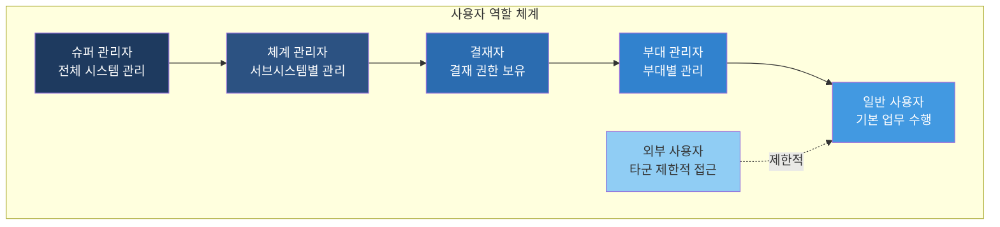

### 역할 상세

| 역할 | 대상자 | 주요 기능 | 인증 방식 |
|:---|:---|:---|:---|
| 슈퍼 관리자 | 전산 담당관 | 전체 시스템 설정, 권한 배정, 로그 조회 | 내부 인증 (Mock) |
| 체계 관리자 | 서브시스템 담당자 | 담당 서브시스템 관리자 메뉴 전체 | 내부 인증 (Mock) |
| 결재자 | 부서장/과장/지휘관 | 결재 승인/반려, 현황 조회 | 내부 인증 (Mock) |
| 부대 관리자 | 부대 행정담당 | 부대별 인원/설정/통계 관리 | 내부 인증 (Mock) |
| 일반 사용자 | 병사/부사관/장교 | 신청, 조회, 게시판 참여 | 내부 인증 (Mock) |
| 외부 사용자 | 타군/민간인 | SYS10 주말버스 예약만 | 외부 전용 로그인 (/sys10/login) |

---

## 2. 역할별 시스템 접근 매트릭스

### 범례

- **F** = Full (전체 접근, 관리자 메뉴 포함)
- **M** = Manage (관리 기능, 설정/통계/관리자 메뉴 일부)
- **A** = Approve (결재 승인/반려)
- **W** = Write (등록/수정/삭제)
- **R** = Read (조회만)
- **-** = 접근 불가

| 서브시스템 | 슈퍼관리자 | 체계관리자 | 결재자 | 부대관리자 | 일반사용자 | 외부사용자 |
|:---|:---:|:---:|:---:|:---:|:---:|:---:|
| 00. 메인 포탈 | F | F | F | F | F | - |
| 01. 초과근무관리 | F | M | A | M | W | - |
| 02. 설문종합관리 | F | M | A | R | W | - |
| 03. 성과관리 | F | M | A | M | W | - |
| 04. 인증서발급 | F | M | A | R | W | - |
| 05. 행정규칙포탈 | F | M | - | R | R | - |
| 06. 해병대규정 | F | M | - | R | R | - |
| 07. 군사자료관리 | F | M | A | M | R | - |
| 08. 부대계보관리 | F | M | A | W | R | - |
| 09. 영현보훈 | F | M | - | W | R | - |
| 10. 주말버스예약 | F | M | - | M | W | W |
| 11. 연구자료관리 | F | M | - | R | R | - |
| 12. 지시건의사항 | F | M | A | W | R | - |
| 13. 지식관리 | F | M | - | R | W | - |
| 14. 나의 제언 | F | M | - | R | W | - |
| 15. 보안일일결산 | F | M | A | M | W | - |
| 16. 회의실예약 | F | M | A | M | W | - |
| 17. 검열결과관리 | F | M | A | W | R | - |
| 18. 직무기술서 | F | M | A | M | W | - |
| 99. 공통 기능 | F | M | - | - | - | - |

---

## 3. 역할별 메뉴 접근 상세

### 3.1 슈퍼 관리자 (Super Admin)

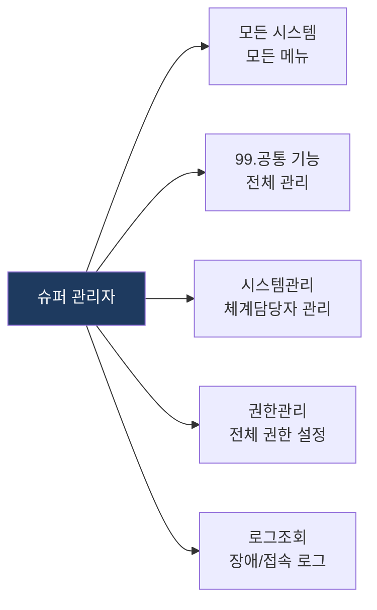

**접근 가능 메뉴:**
- 모든 서브시스템의 모든 메뉴 (관리자 메뉴 포함)
- 99. 공통 기능: 시스템관리, 결재관리, 코드관리, 공통게시판, 권한관리
- 각 서브시스템 `/sysXX/admin/*` 전체

### 3.2 체계 관리자 (System Admin)

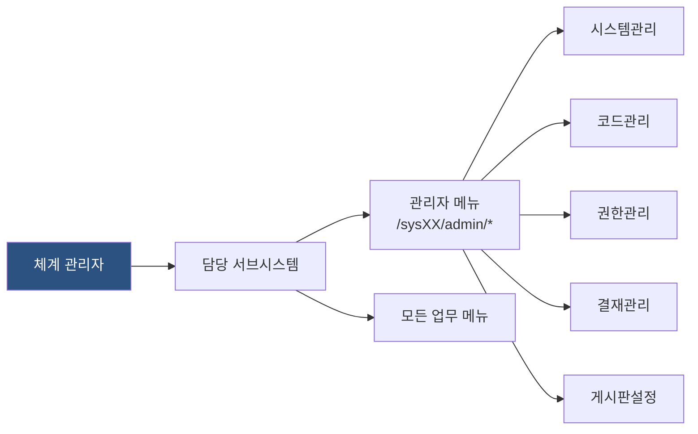

**접근 가능 메뉴:**
- 담당 서브시스템의 관리자 메뉴 전체 (`/sysXX/admin/*`)
- 담당 서브시스템의 모든 업무 메뉴
- 시스템관리(체계담당자/메뉴관리/메시지관리/로그조회), 코드관리, 권한관리, 결재관리, 게시판설정

### 3.3 결재자 (Approver)

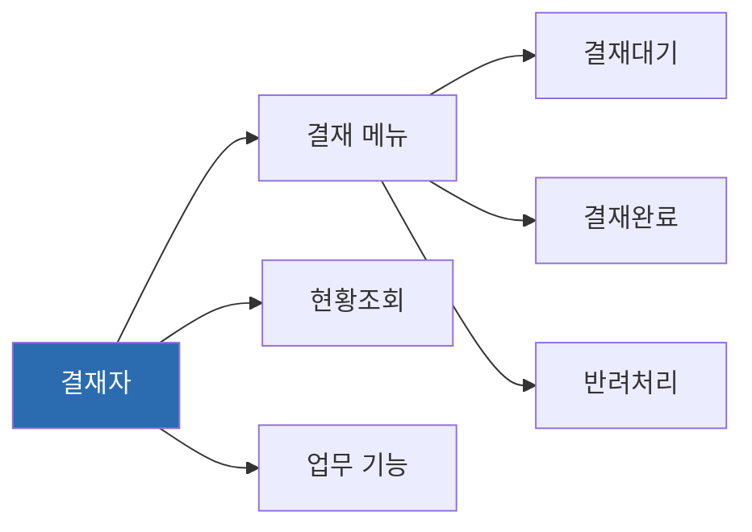

**결재 기능이 있는 시스템과 결재 대상:**

| 시스템 | 결재 대상 메뉴 | 구현 라우트 |
|--------|---------------|------------|
| 01. 초과근무 | 신청서 결재, 일괄처리 승인, 월말결산 | `/sys01/1/2`, `/sys01/1/4`, `/sys01/1/5` |
| 02. 설문관리 | 설문 결재 | `/sys02/1/5` (체계관리) |
| 03. 성과관리 | 과제실적 승인, 평가 결재 | `/sys03/3/4`, `/sys03/3/5`, `/sys03/3/6` |
| 04. 인증서발급 | 인증서 승인/관리 | `/sys04/1/3` |
| 07. 군사자료 | 자료 결재 | (admin 결재선) |
| 08. 부대계보 | 주요활동 결재 | `/sys08/3/2` |
| 12. 지시건의 | 지시사항/건의사항 결재 | `/sys12/4/1` |
| 15. 보안결산 | 일일결산 결재 | `/sys15/4/1`, `/sys15/4/2` |
| 16. 회의실예약 | 예약 승인/관리 | `/sys16/1/5` |
| 17. 검열결과 | 후속조치 결재 | `/sys17/1/5` |
| 18. 직무기술서 | 기술서 결재 | `/sys18/1/4` |

### 3.4 부대 관리자 (Unit Manager)

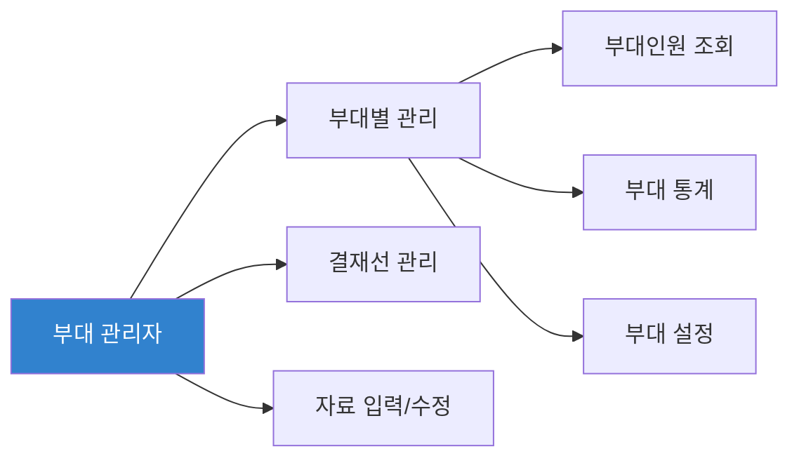

**접근 가능 메뉴:**

| 시스템 | 접근 메뉴 | 구현 라우트 |
|--------|----------|------------|
| 01. 초과근무 | 부대인원 조회, 최대인정시간, 근무시간/공휴일/결재선 관리, 당직업무 | `/sys01/3/*`, `/sys01/4/*` |
| 03. 성과관리 | 평가조직 관리, 과제 관리, 평가 | `/sys03/2/2`, `/sys03/3/*` |
| 07. 군사자료 | 자료 관리(등록/수정), 통계 | `/sys07/1/1`, `/sys07/1/3` |
| 10. 주말버스 | 배차관리, 예약시간관리, 위규자관리 | `/sys10/1/5`, `/sys10/1/6`, `/sys10/1/8` |
| 15. 보안결산 | 사무실보안결산, 일일보안점검관, 부재처리, 결산종합현황 | `/sys15/3/2`, `/sys15/3/3`, `/sys15/3/5`, `/sys15/5/*` |
| 16. 회의실예약 | 회의예약관리, 회의실 관리 | `/sys16/1/5`, `/sys16/1/6` |
| 18. 직무기술서 | 조직진단 대상 관리, 표준업무시간 | `/sys18/1/2`, `/sys18/2/2` |

### 3.5 일반 사용자 (General User)

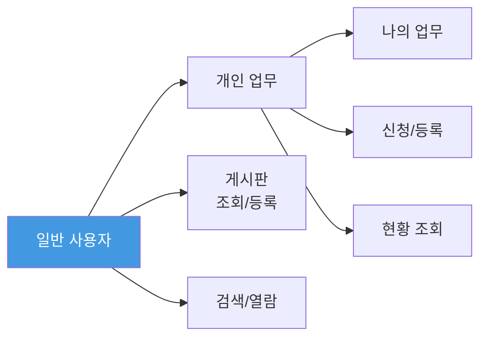

**접근 가능 메뉴:**

| 시스템 | 접근 메뉴 | 구현 라우트 |
|--------|----------|------------|
| 01. 초과근무 | 신청서 작성, 나의 근무현황, 나의 부재관리, 개인설정 | `/sys01/1/1`, `/sys01/2/1`, `/sys01/2/2`, `/sys01/5/*` |
| 02. 설문관리 | 나의 설문관리, 설문참여, 지난 설문보기 | `/sys02/1/2`, `/sys02/1/3`, `/sys02/1/4` |
| 03. 성과관리 | 업무실적 입력, 과제검색, 평가결과(본인) | `/sys03/3/3`, `/sys03/6/1`, `/sys03/4/1` |
| 04. 인증서발급 | 인증서 신청, 신청현황 조회 | `/sys04/1/2` |
| 05. 행정규칙 | 현행규정/예규/지시 조회 | `/sys05/1/1`, `/sys05/2/*`, `/sys05/3/1` |
| 06. 해병대규정 | 현행규정/예규/지시 조회, 게시판 | `/sys06/1/1`, `/sys06/2/*`, `/sys06/3/1`, `/sys06/4/*` |
| 07. 군사자료 | 자료 열람, 활용 신청 | `/sys07/1/1`, `/sys07/1/2` |
| 08. 부대계보 | 권한신청, 조회 | `/sys08/2/1`, `/sys08/2/3` |
| 09. 영현보훈 | 자료 조회, 통계 출력 | `/sys09/3/*` |
| 10. 주말버스 | 예약, 내 예약 확인, 예약현황 | `/sys10/1/2`, `/sys10/1/4` |
| 11. 연구자료 | 연구자료 조회, 다운로드 | `/sys11/1/1`, `/sys11/1/2` |
| 13. 지식관리 | 나의 지식 등록, 지식열람, 추천/평가 | `/sys13/2/1`, `/sys13/3/1` |
| 14. 나의 제언 | 제언 등록, 제언 확인 | `/sys14/1/1`, `/sys14/1/3` |
| 15. 보안결산 | 개인보안일일결산, 개인보안수준평가, 개인설정 | `/sys15/3/1`, `/sys15/3/4`, `/sys15/6/1` |
| 16. 회의실예약 | 예약신청, 내예약확인, 회의현황 | `/sys16/1/2`, `/sys16/1/3`, `/sys16/1/4` |
| 18. 직무기술서 | 직무기술서 작성(개인), 조회 | `/sys18/1/3` |
| 모든 시스템 | 공지사항/질의응답 게시판 | 각 시스템 게시판 라우트 |

### 3.6 외부 사용자 (External User)

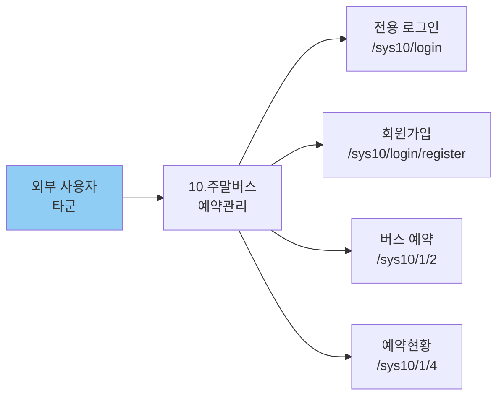

**접근 가능 메뉴:**

| 메뉴 | 경로 | 컴포넌트 |
|------|------|----------|
| 외부 전용 로그인 | `/sys10/login` | ExternalLoginPage |
| 회원가입 | `/sys10/login/register` | ExternalRegisterPage |
| 버스 예약 | `/sys10/1/2` | BusReservationPage |
| 예약현황 조회 | `/sys10/1/4` | BusReservationStatusPage |

---

## 4. 시스템별 역할-메뉴 관계도

### 4.1 초과근무관리체계 (SYS01)

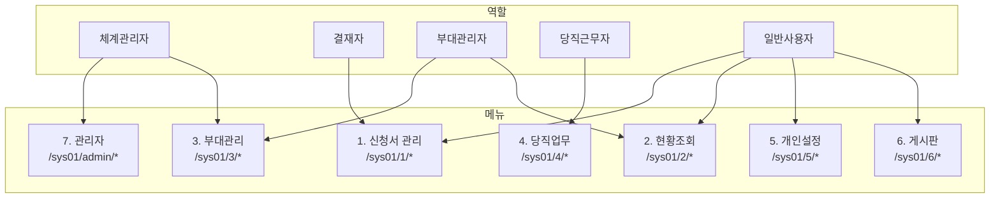

### 4.2 보안일일결산체계 (SYS15)

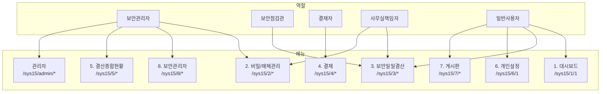

### 4.3 성과관리체계 (SYS03)

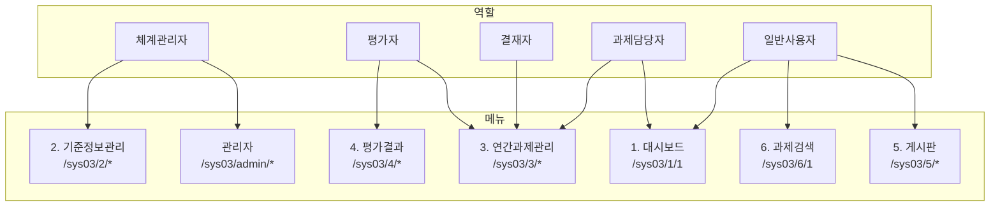

### 4.4 주말버스예약관리체계 (SYS10) -- 외부 사용자 포함

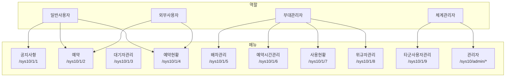

---

## 5. 권한 관리 체계도

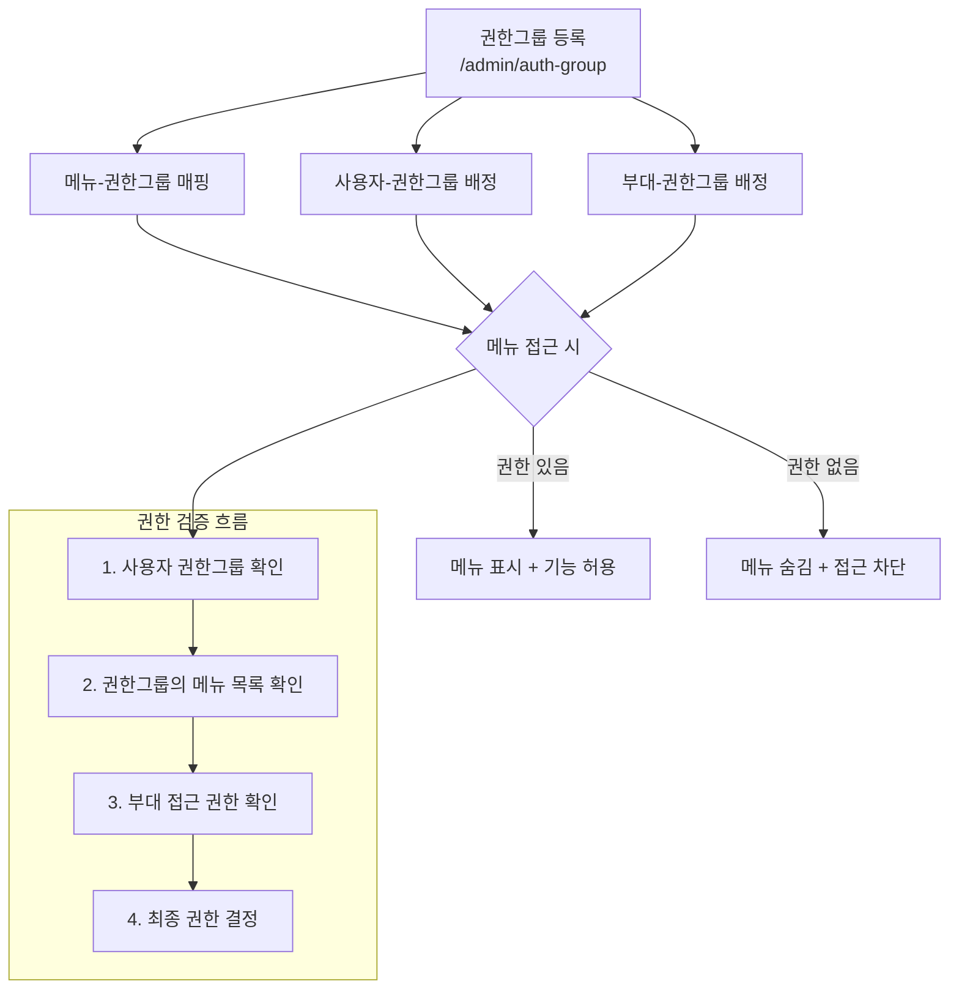

### 권한관리 공통 기능 (99_공통기능)

| 기능 | 경로 | 설명 |
|------|------|------|
| 권한그룹 등록 | `/admin/auth-group` | 역할별 권한그룹 CRUD |
| 권한그룹별 메뉴 등록 | `/admin/auth-group` | 권한그룹에 접근 가능한 메뉴 배정 |
| 메뉴별 권한그룹 등록 | `/admin/auth-group` | 메뉴에 접근 가능한 권한그룹 배정 |
| 권한그룹별 사용자 등록 | `/admin/auth-group` | 사용자를 권한그룹에 배정 |
| 권한그룹별 사용부대 등록 | `/admin/auth-group` | 부대를 권한그룹에 배정 |

---

## 6. 공통 기능 재사용 관계도

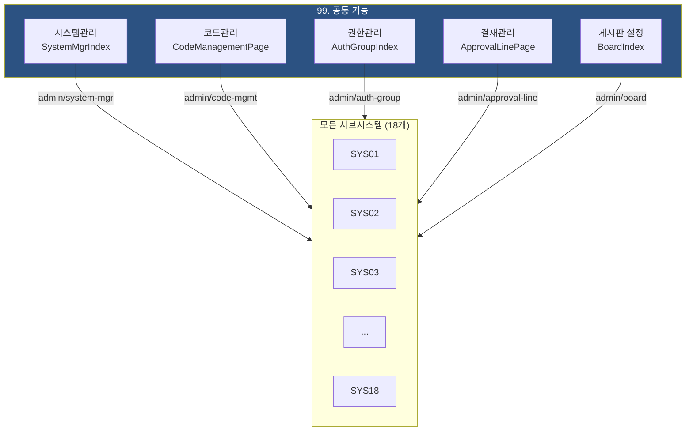

### 공통 컴포넌트 사용 현황

| 공통 컴포넌트 | 용도 | 사용 시스템 | 비고 |
|:---|:---|:---|:---|
| AdminRoutes | 관리자 대메뉴 통합 라우트 | 전 시스템 (18개) | `/sysXX/admin/*` |
| BoardIndex / BoardListPage | 게시판 목록/설정 | 전 시스템 (18개) | boardId, sysCode 파라미터로 구분 |
| CodeManagementPage | 코드그룹/코드 CRUD | SYS02,04,07,10,13,16,17,18 | 개별 라우트 또는 admin 경유 |
| AuthGroupIndex | 권한그룹 5종 탭 | 전 시스템 (18개) | 개별 라우트 또는 admin 경유 |
| ApprovalLinePage | 결재선 CRUD | 결재 기능 시스템 (11개) | admin 경유 |
| MenuMgmtIndex | 메뉴 CRUD | SYS13 | 일부 시스템에서 개별 사용 |
| AccessLogIndex | 접속로그 조회 | SYS17 | 일부 시스템에서 개별 사용 |

---

## 7. 인증 흐름도

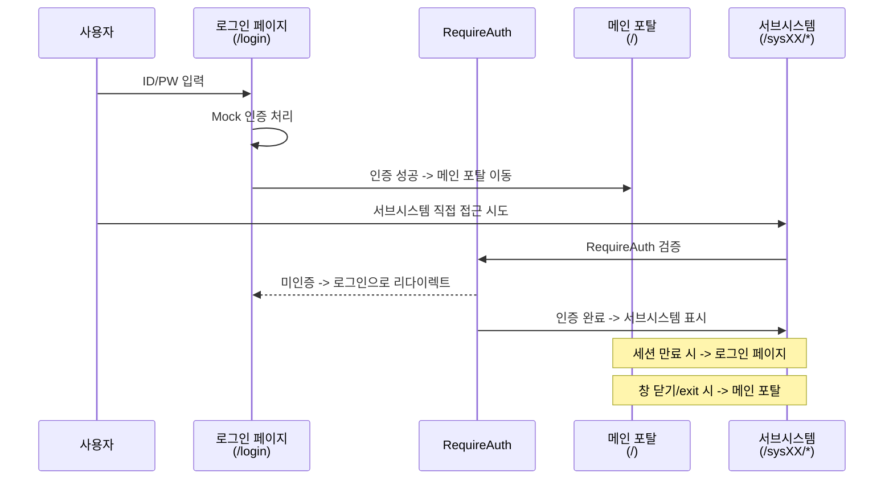

### 외부 사용자 인증 (SYS10)

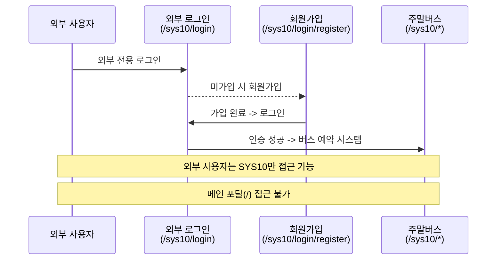

---

## 8. 서브시스템별 고유 역할

일부 서브시스템은 공통 역할 외에 고유 역할이 존재한다.

| 서브시스템 | 고유 역할 | 접근 메뉴 |
|:---|:---|:---|
| SYS01 초과근무 | 당직근무자 | 당직업무 (4. 초과근무자/당직개소 관리) |
| SYS08 부대계보 | 부대기록 담당관 | 주요활동/주요직위자/부대기록부 입력 |
| SYS09 영현보훈 | 보훈 담당관 | 자료입력 (사망자/상이자/심사 관리) |
| SYS15 보안결산 | 보안점검관 | 일일보안점검관 (/sys15/3/3) |
| SYS15 보안결산 | 사무실책임자 | 사무실보안일일결산 (/sys15/3/2) |
| SYS15 보안결산 | 보안관리자 | 보안관리자 메뉴 (/sys15/8/*) |
| SYS17 검열결과 | 검열관 | 검열부대 지정, 검열계획/결과 입력 |
| SYS10 주말버스 | 타군 사용자 | 외부 로그인 경유 예약만 가능 |

---

## 9. 접근 제어 요약 다이어그램

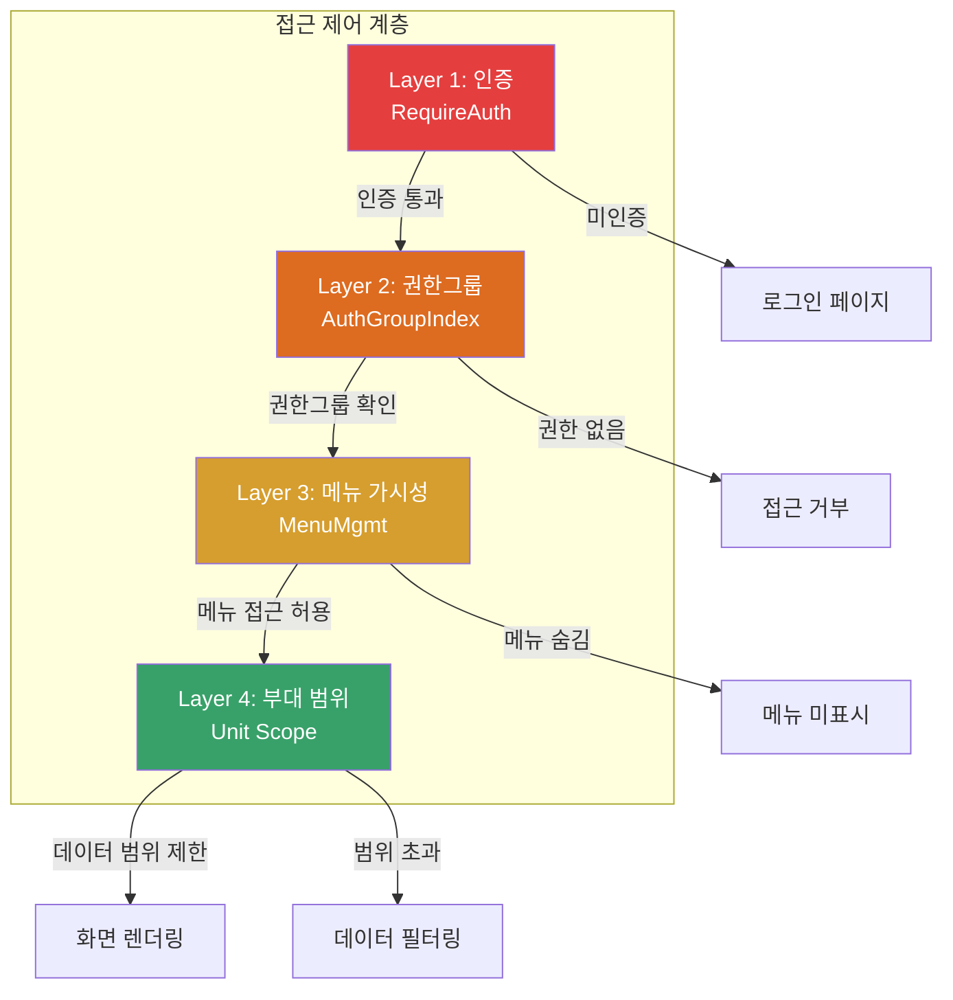

| 계층 | 구현 방식 | 현재 상태 |
|------|----------|----------|
| Layer 1: 인증 | RequireAuth 컴포넌트 | Mock 인증 구현 완료 |
| Layer 2: 권한그룹 | AuthGroupIndex (공통 기능) | UI 구현 완료, 로직 Mock |
| Layer 3: 메뉴 가시성 | MenuMgmt (공통 기능) | UI 구현 완료, 로직 Mock |
| Layer 4: 부대 범위 | 부대 코드 기반 필터링 | 추후 백엔드 연동 시 구현 |
